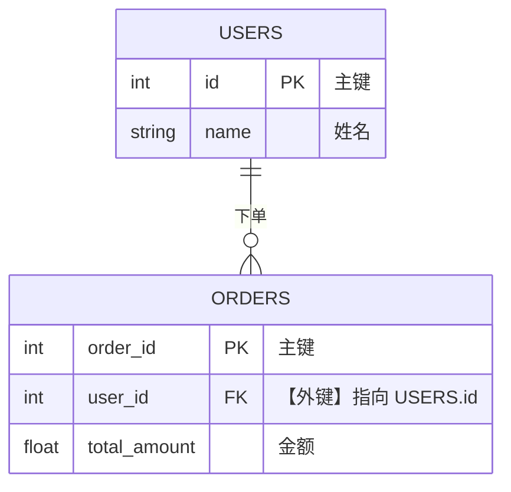
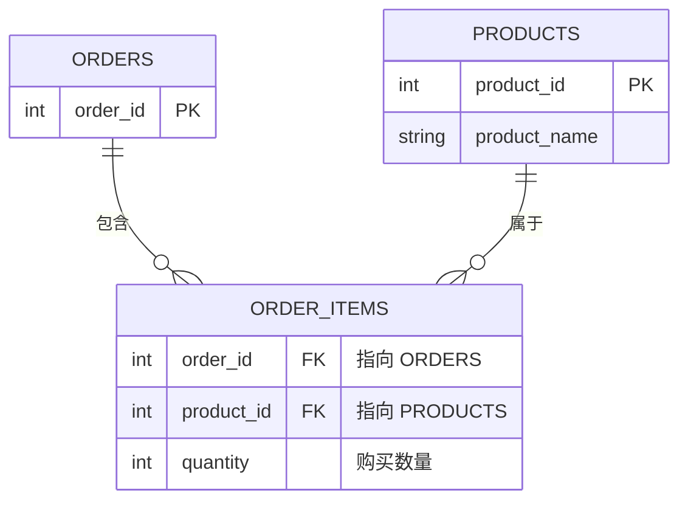

# 01.02 关系模型与实体映射 (建立骨架)

> **故事线与承上启下**：
> *上一节我们决定了使用 MySQL 作为订单系统的主力数据库。然而，MySQL 是一个“关系型数据库（RDBMS）”。在把复杂的电商世界（商品、用户、订单、支付流水）塞进 MySQL 之前，我们必须学会一种特殊的魔法：如何把立体、多维的现实世界，拍扁成一张张相互关联的二维表格。这，就是关系模型与实体映射。*

## ⚡ 速查摘要

- **实体与表 (Entity & Table)**：现实世界的一个名词（如“用户”），对应数据库里的一张“表”。
- **属性与列 (Attribute & Column)**：名词的特征（如“名字”、“价格”），对应表里的“列”。
- **主键 (Primary Key)**：实体的唯一身份证（如身份证号），绝对不能重复，绝对不能为 NULL。
- **外键 (Foreign Key)**：实体之间产生联系的纽带（如订单表里记录的“买家ID”）。
- **三大关系映射**：一对一（1:1）、一对多（1:N）、多对多（N:M）。

## 🎯 学习目标 + 验收标准

- **目标**：掌握如何将业务需求拆解为数据库表，深刻理解主键与外键的协作机制，掌握 1:N 和 N:M 关系的标准设计模式。
- **验收标准**：能够准确判断“用户”与“订单”、“订单”与“商品”之间的映射关系。

## 📖 概念全景

### 1. 现实世界到二维表格的降维打击
在程序代码里，一个 User 往往是一个包含很多层级的嵌套 JSON 对象。但在关系型数据库中，**一切皆为二维表 (Table)**。
- **表 (Table)** = 实体集合。比如 `users` 表存放所有用户。
- **行 (Row / Record)** = 一个具体的实体实例。比如 `users` 表里的第一行就是“张三”。
- **列 (Column / Field)** = 实体的属性。比如每一行都有 `name`、`age`、`phone`。

### 2. 主键 (Primary Key, PK)：没有它，世界就会混乱
假设数据库里有两条记录，名字都叫“王伟”，年龄都是 25 岁。如果你要给其中一个“王伟”扣款，数据库怎么知道该扣谁的钱？
**主键**是每一行数据的**唯一标识符**。
- **唯一性**：表中任意两行的主键值绝不相同。
- **不可空**：主键绝对不能是空值（NULL）。
- **不可变性**：一旦分配，通常不应再修改。
*(底层提示：在 InnoDB 引擎中，主键不仅仅是标识，整张表的数据在磁盘上就是**按照主键顺序物理排列**的。这被称为“聚簇索引”。)*

### 3. 表与表的羁绊：三大关系映射
独立的表是死板的。现实中的实体总是相互交织（张三买了苹果）。这时候就需要用到**外键 (Foreign Key)** 来建立连接。

#### 一对多 (1:N)
- **业务**：一个“用户”可以拥有多个“订单”，但一个“订单”只属于一个“用户”。
- **设计范式**：在“多”的那一方（订单表）添加一个字段，记录“一”的那一方（用户表）的主键。



#### 多对多 (N:M)
- **业务**：一个“订单”可以包含多个“商品”，一个“商品”也可以出现在多个“订单”中。
- **设计范式**：**必须引入第三张中间表**。中间表记录两者的关联关系，包含双方的主键。


*（提示：`ORDER_ITEMS` 就是我们常说的“订单详情表”。）*


## 💻 SQL 语法（预览）

这是我们在未来章节会学到的建表语法预览，带你感受一下主外键是如何用 SQL 表达的：

```sql
-- 一对多中的“一”
CREATE TABLE users (
    id INT PRIMARY KEY,   -- 声明为主键
    name VARCHAR(50)
);

-- 一对多中的“多”
CREATE TABLE orders (
    order_id INT PRIMARY KEY,
    user_id INT,
    -- 声明外键：限制 user_id 必须是 users 表里真实存在的 id
    FOREIGN KEY (user_id) REFERENCES users(id) 
);
```

## 🏗️ 项目实战 —— 订单系统场景

作为架构师，你需要为我们的电商系统进行第一版的架构白板推演。
产品经理提出：“我们的核心闭环是，用户注册后，可以在购物车里勾选多个商品，最后合并支付生成一笔订单。”

在此需求中，你迅速提取出核心实体：**用户(User)**、**商品(Product)**、**订单(Order)**。并且在白板上画出了它们的关系：
- **User 与 Order** 是 1:N 关系（UserID 作为 Order 的外键）。
- **Order 与 Product** 是 N:M 关系（必须创建一个 `order_items` 中间表，通过 OrderID 和 ProductID 将它们连接起来）。

如果这步做错了，比如你试图在订单表里加一个列叫 `products` 然后把商品用逗号拼起来（`"apple,banana"`），这就违反了关系型数据库的**第一范式**，会导致后续无法按商品统计销量！

## ⚠️ **常见坑点**

- **用手机号或身份证做主键**：虽然它们具有唯一性，但在真实业务中，用户可能会换手机号，甚至注销账号。主键一旦改变，所有关联它的外键都需要级联更新，代价极大。**最佳实践：永远使用与业务无关的无意义自增数字或雪花算法 ID 作为主键。**

## 🧠 主动回忆

1. 如果不建中间表，直接在商品表中加一列 `order_id` 来实现订单和商品的关系，会导致什么灾难性后果？

灾难：这直接将关系错乱成了“一笔订单只能包含多个商品，但一个商品只能属于一笔订单”。当下一个用户购买同一个商品时，商品表中的 order_id 会被覆盖，前一个用户的订单直接找不到商品，导致整个电商系统的核心资产（交易数据）彻底错乱。


2. 在 InnoDB 引擎中，主键对数据的物理存储有什么影响？

本质：InnoDB 是索引组织表。它的数据本身就是索引，索引本身就是数据。主键就是这棵 B+ 树的查找路径。没有主键或主键无序，意味着数据在磁盘上的存储变成了一盘散沙，高并发下的每一笔写入都在让机械硬盘/SSD 进行痛苦的随机擦写。

## ✅ 项目练习

去 `exercises/01.02-relational-model` 目录下，完成你的实体映射设计测试！


# 延伸和深度学习

## [主键](../../code/主键.md)
1. 任何表都需要主键吗
2. 为什么绝对不要用业务字段（如手机号、身份证、邮箱）做主键？（业务演进）
3. 为什么推荐使用“无意义的自增 ID 或雪花算法”作为主键
4. 何时使用自增ID/雪花算法作为主键


## [主键， 索引](../../code/主键与索引.md) 
