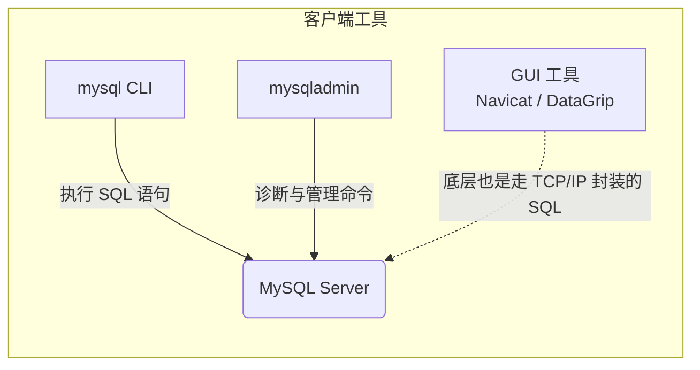

# 02.02 客户端与工具链

> **故事线与承上启下**：
> *经过上一节的学习，我们已经在 Docker 中稳稳地把 MySQL 跑起来了。但在真实的电商开发场景中，我们不可能通过“意念”去管理数据库。我们需要强有力的兵器去刺穿容器的黑盒，和数据库引擎进行对话。今天，我们将手握 DBA（数据库管理员）最信任的两把神兵：原生命令行（CLI）与现代图形界面（GUI）。*

## ⚡ 速查摘要

1. **连接四大金刚**：`-h` (主机), `-P` (大写，端口), `-u` (用户), `-p` (小写，密码)。

```sql
mysql -h 127.0.0.1 -P 3306 -u root -p
```

```text
-h：Host（主机，连谁）
-P：Port（端口，走哪个门，因为 p 被密码抢了，所以用大写 P）
-u：User（用户，你是谁）
-p：password（密码，你的通行证）
-e：Execute（执行，打完就跑）
```


2. **非交互式执行**：使用 `-e` 参数可以直接执行 SQL 并退回 Bash，是自动化脚本的神器。
```sh
Docker compose exec mysql-learn mysql -uroot -proot123 -e "SELECT 'Ready for duty' AS status;"

```
3. **批处理导入**：使用 `<` 将 `.sql` 文件重定向喂给 mysql 命令，实现海量数据极速还原。

```bash
mysql -uroot -proot123 < cities.sql
```

mysql < data.sql：箭头指向 mysql，意思是把文件里的数据像漏斗一样倒进数据库（还原/导入）。
mysqldump > data.sql：箭头指向文件，意思是把数据库里的数据抽出来存进文件（备份/导出）。

4. **管理利器**：`mysqladmin` 用于监控数据库健康状态（如 `ping`、`status`）。


## 🎯 学习目标 + 验收标准

- **目标**：彻底告别“只会点点点”的菜鸟思维，掌握在纯 Linux 服务器上，脱离鼠标也能对数据库进行控制和诊断的硬核能力。
- **验收标准**：能够写出一条完整的 `mysql` 命令行代码，不进入交互界面，直接拿到数据库的返回结果。

## 📖 概念全景

### 1. 原生 CLI：MySQL 的绝对主场
图形界面（GUI）虽然直观，但在生产环境的跳板机上，或者在编写自动化 CI/CD 脚本时，你**没有任何图形界面可用**，只能依赖 `mysql` 命令行工具。

**【连接数据库的标准姿势】**
```bash
mysql -h 127.0.0.1 -P 3306 -u root -p
```
*（提示：输入上述命令后，终端会让你隐式输入密码，这比直接在命令里写 `-proot123` 更安全，因为不会被记录在历史命令 `history` 中。）*

**为什么不直接写 `mysql -u root -p`？**
如果不加 `-h` 和 `-P`，MySQL 客户端默认尝试通过本地的 `socket` 文件连接，而不是网络。明确指定 `-h 127.0.0.1` 会强制走 TCP/IP 网络协议，这在排查网络连通性问题时极其关键。

### 2. 自动化之魂：非交互式执行 (-e)
在做服务器巡检或编写 Bash 脚本时，我们不希望“进入” MySQL 的 `mysql>` 提示符界面，而是希望一枪打完直接收起武器。
这时候就需要用到 `-e` (Execute) 参数：

```bash
# 查完版本号，直接退回 linux 终端
mysql -uroot -proot123 -e "SELECT VERSION();"

# 输出结果可能是：
+-----------+
| VERSION() |
+-----------+
| 8.4.0     |
+-----------+
```
*(架构师视角：配合 `grep` 和 `awk`，你可以利用 `-e` 参数写出非常强大的数据库自动化巡检脚本。)*

### 3. 数据还原：批处理模式 (<)
假设产品经理给了你一个 500MB 的包含全国城市数据的 `cities.sql` 文件。如果你用图形界面打开它再点击运行，很可能会导致软件内存溢出 (OOM) 直接卡死。

**CLI 批处理导入是最快、最稳的方式**：
```bash
mysql -uroot -proot123 < cities.sql
```
这利用了 Linux 的标准输入重定向（`<`），如同用漏斗直接往数据库里倒水一样，速度极快。

### 4. 诊断医生：mysqladmin 工具
除了 `mysql`，MySQL 安装包还附带了一个诊断工具 `mysqladmin`。
- `mysqladmin -uroot -p ping`：检查数据库是否存活。
- `mysqladmin -uroot -p status`：获取数据库的运行时间、当前线程数、慢查询数量等健康指标。



### 5. GUI 工具：解放生产力的现代兵器
虽然 CLI 是内功，但在日常研发写复杂查询时，GUI 绝对是解放双手的神兵。
- **Navicat**：国内普及度极高，轻量，同步结构功能极强（商业收费）。
- **DataGrip**：JetBrains 出品，写 SQL 的智能提示天下第一（商业收费）。
- **DBeaver**：基于 Java，支持几乎世界上所有数据库，免费开源的良心之作。

*只要你懂得了底层的 `-h`, `-P`, `-u`, `-p`，你在这些 GUI 软件里填写连接配置时就会得心应手。*

## 🏗️ 项目实战 —— 订单系统场景

作为电商系统的架构师，为了监控接下来的订单压测情况，你需要写一个巡检脚本。
但现在你的宿主机（Mac）上并没有安装 `mysql` 客户端，所有环境都在 Docker 里！
这难不倒你，你巧妙地结合了 Docker 的 `exec` 命令和 MySQL 的 `-e` 参数，在不安装任何本地依赖的情况下，完成了对容器内数据库的刺探：

```bash
docker compose exec mysql-learn mysql -uroot -proot123 -e "SHOW DATABASES;"
```

## ⚠️ 常见坑点

- **连不上数据库，报错 Connection Refused**：
  在 Docker 环境中，如果你在宿主机上执行 `mysql -h localhost` 可能会连不上。这是因为 `localhost` 被解析为了走 Socket，或者被解析到了错误的网卡。**永远使用 `127.0.0.1` 替代 `localhost` 来测试网络连通性。**

## 🧠 主动回忆

1. 在编写自动化脚本时，如何让 `mysql` 命令执行完一段查询后立刻自动退出？

加上 -e指令参数

2. 如果你的同事发给你一个 2GB 的 `.sql` 备份文件，你该如何最稳妥地把它导入到数据库中？

使用 批处理模式 (<)


## 🚀 延伸与深度学习

> 架构之路永无止境。如果你对本节内容意犹未尽，以下是为你精选的深度拓展方向，供你在未来进阶时探索：

- **MySQL Shell (mysqlsh)**：官方主推的新一代客户端工具。它不仅支持传统的 SQL，还支持 JavaScript 和 Python！你可以用熟悉的编程语言去管理数据库集群，甚至它还内置了极为强悍的并发导入导出工具。
- **.my.cnf 免密登录配置**：在生产服务器上，为了避免在 Bash 脚本中明文写上 `-proot123` 带来安全隐患，架构师通常会将账密写死在当前用户的 `~/.my.cnf` 文件中，并赋予 `600` 权限，从而实现输入 `mysql` 就直接安全进入。
- **Percona Toolkit (pt-query-digest)**：当你通过 CLI 管理数据库时，原生的 `mysqladmin` 有时不够用。Percona 提供的一系列命令行套件（如慢查询分析）是每个高级 DBA 的压箱底宝贝。

## ✅ 项目练习

去 `exercises/02.02-cli-tools` 目录下，完成你的第一个非交互式巡检脚本测试！
